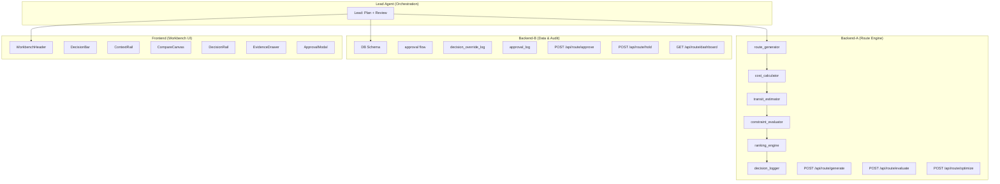

# Implementation Plan — Multi-Route Optimization MVP v1.0.0

## Phase 1 — Backend Core

### 1.1 문제 정의
- 현재 상태: Spec/Plan/Layout 문서만 존재, 코드 없음
- 목표 상태: MVP v1.0.0 production-ready 코드
- 영향: 1 product team, 3 roles (OPS_ADMIN, LOGISTICS_APPROVER, LOGISTICS_REVIEWER)

### 1.2 제안 옵션

| 옵션 | 설명 | 공수 | 리스크 | 비용 |
|------|------|------|--------|------|
| A | Sequential (1 agent) | 60일 | 지연 | AED 0 |
| B | Parallel 4-agent | 15일 | 충돌 | AED 0 |
| C | Hybrid (2 agent) | 30일 | 중간 | AED 0 |

**추천: B — Parallel 4-agent** (Enables 4x faster delivery with proper coordination)

### 1.3 롤백 전략
모듈 단위 커밋으로 부분 롤백 가능. 각 agent는 독립 모듈 작업.

---

## Phase 2 — Engineering Plan

### 2.1 Mermaid Architecture



### 2.2 파일 변경 목록

#### Backend-A (Route Engine) — `src/backend/route_engine/`
| 파일 | 유형 | 설명 |
|------|------|------|
| `src/backend/route_engine/__init__.py` | create | Module init |
| `src/backend/route_engine/route_generator.py` | create | SEA_DIRECT/TRANSSHIP/LAND generation |
| `src/backend/route_engine/cost_calculator.py` | create | Cost breakdown computation |
| `src/backend/route_engine/transit_estimator.py` | create | ETA/transit calculation |
| `src/backend/route_engine/constraint_evaluator.py` | create | WH/deadline/docs constraints |
| `src/backend/route_engine/ranking_engine.py` | create | Score ranking + tie-breaker |
| `src/backend/route_engine/decision_logger.py` | create | Audit logging |
| `src/backend/route_engine/types.py` | create | Pydantic models |
| `src/backend/route_engine/rules/` | create | YAML rule loaders |
| `tests/unit/test_route_engine.py` | create | Unit tests |

#### Backend-B (Data & Audit) — `src/backend/data/`
| 파일 | 유형 | 설명 |
|------|------|------|
| `src/backend/data/__init__.py` | create | Module init |
| `src/backend/data/schema.sql` | create | PostgreSQL schema |
| `src/backend/data/models.py` | create | ORM/persistence models |
| `src/backend/data/approval_service.py` | create | Approval/hold logic |
| `src/backend/data/audit_repository.py` | create | Audit log persistence |
| `tests/integration/test_approval_flow.py` | create | Integration tests |

#### API Layer — `src/app/api/route/`
| 파일 | 유형 | 설명 |
|------|------|------|
| `src/app/api/route/generate/route.ts` | create | POST /api/route/generate |
| `src/app/api/route/evaluate/route.ts` | create | POST /api/route/evaluate |
| `src/app/api/route/optimize/route.ts` | create | POST /api/route/optimize |
| `src/app/api/route/approve/route.ts` | create | POST /api/route/approve |
| `src/app/api/route/hold/route.ts` | create | POST /api/route/hold |
| `src/app/api/route/dashboard/[request_id]/route.ts` | create | GET /api/route/dashboard |

#### Frontend (Workbench) — `src/app/workbench/`
| 파일 | 유형 | 설명 |
|------|------|------|
| `src/app/workbench/[request_id]/page.tsx` | create | Main workbench page |
| `src/app/workbench/components/WorkbenchHeader.tsx` | create | Header component |
| `src/app/workbench/components/DecisionBar.tsx` | create | Decision bar |
| `src/app/workbench/components/ContextRail.tsx` | create | Context rail |
| `src/app/workbench/components/CompareCanvas.tsx` | create | Compare canvas |
| `src/app/workbench/components/DecisionRail.tsx` | create | Decision rail |
| `src/app/workbench/components/EvidenceDrawer.tsx` | create | Evidence drawer |
| `src/app/workbench/components/ApprovalModal.tsx` | create | Approval modal |
| `src/app/workbench/hooks/useWorkbenchState.ts` | create | State management |
| `src/app/workbench/types.ts` | create | Type definitions |
| `tests/e2e/workbench.spec.ts` | create | E2E tests |

#### Rules — `rules/`
| 파일 | 유형 | 설명 |
|------|------|------|
| `rules/route_rules.yaml` | create | Route generation rules |
| `rules/cost_rules.yaml` | create | Cost weights/penalties |
| `rules/transit_rules.yaml` | create | Transit buffers |
| `rules/doc_rules.yaml` | create | Document requirements |
| `rules/risk_rules.yaml` | create | Risk evaluation rules |

### 2.3 의존성 & 순서

```
Backend-A (Route Engine) — 독립적, 가장 먼저 시작
    ↓ 완료 후
API Routes — Backend-A 의존

Backend-B (Data) — 독립적, Backend-A와 병렬
    ↓ 완료 후
API Routes — Backend-B 의존

Frontend — API 완료 후 시작 (병렬 가능)
```

### 2.4 테스트 전략

| 수준 | 범위 | 도구 |
|------|------|------|
| Unit | route_generator, cost_calculator, transit_estimator, constraint_evaluator, ranking_engine | pytest |
| Integration | generate→evaluate→optimize, approve→hold→reevaluate | pytest |
| E2E | Workbench load, drawer open, approval flow | Playwright |
| Performance | /generate ≤800ms, /evaluate ≤1500ms, /optimize ≤2000ms | k6 |

### 2.5 리스크 & 완화

| 리스크 | 완화 |
|--------|------|
| Agent 충돌 (동일 파일 편집) | 각 agent 전용 디렉토리 배정 |
| API contract 불일치 | Spec.md SSOT 준수, Lead review |
| 데이터 무결성 누락 | jsonb + CHECK constraint 병행 |
| UX 불일치 | layout.md SSOT, Frontend Lead review |

---

## 2.6 Agent Teams 구성

| Agent | Model | Directory | Responsibilities |
|-------|-------|-----------|-------------------|
| Lead | Opus | `/` | Orchestration, plan execution, final review |
| Backend-A | Sonnet | `src/backend/route_engine/` + `src/app/api/route/` | Route engine, cost, transit, ranking, APIs |
| Backend-B | Sonnet | `src/backend/data/` + `src/app/api/route/approval/` | DB schema, persistence, approval flow |
| Frontend | Sonnet | `src/app/workbench/` | Workbench UI components |

---

## Approval

[ ] Phase 1 승인 — 위 계획으로 4-agent 병렬 실행 승인
