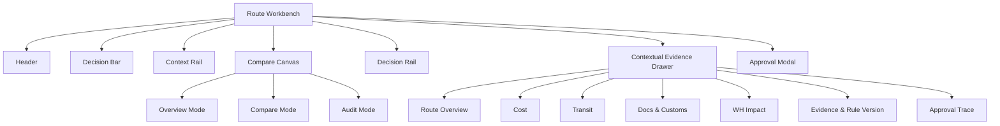
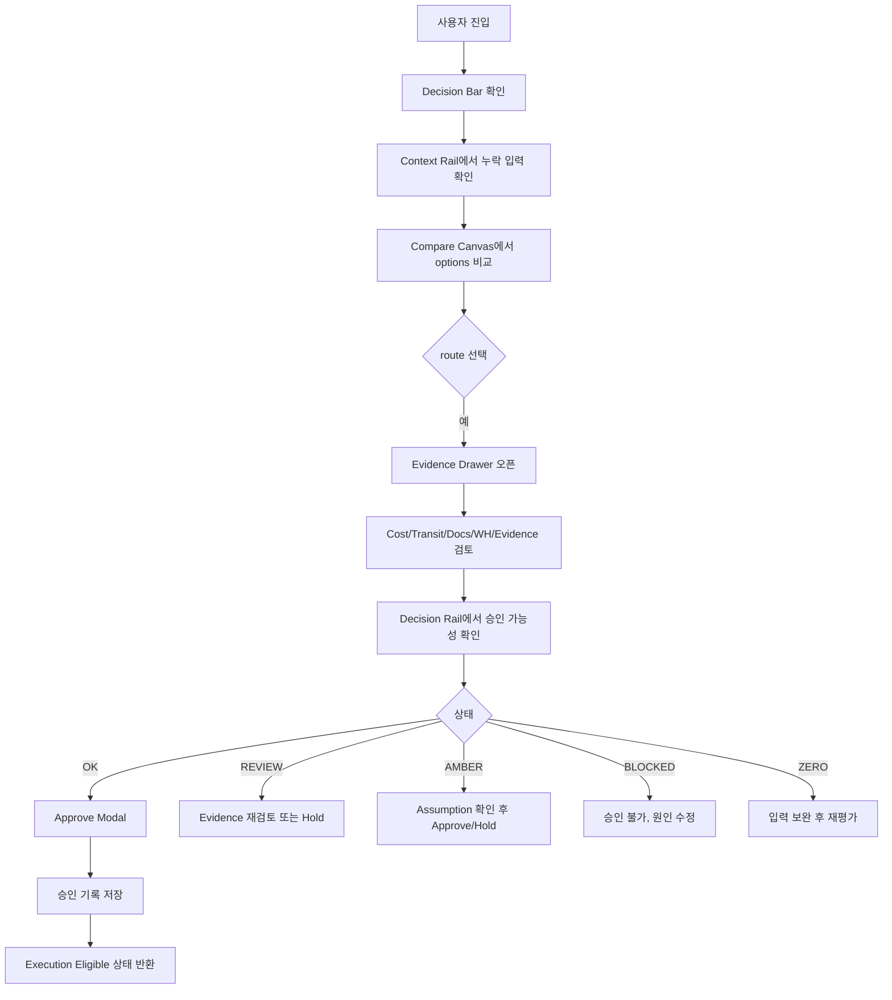
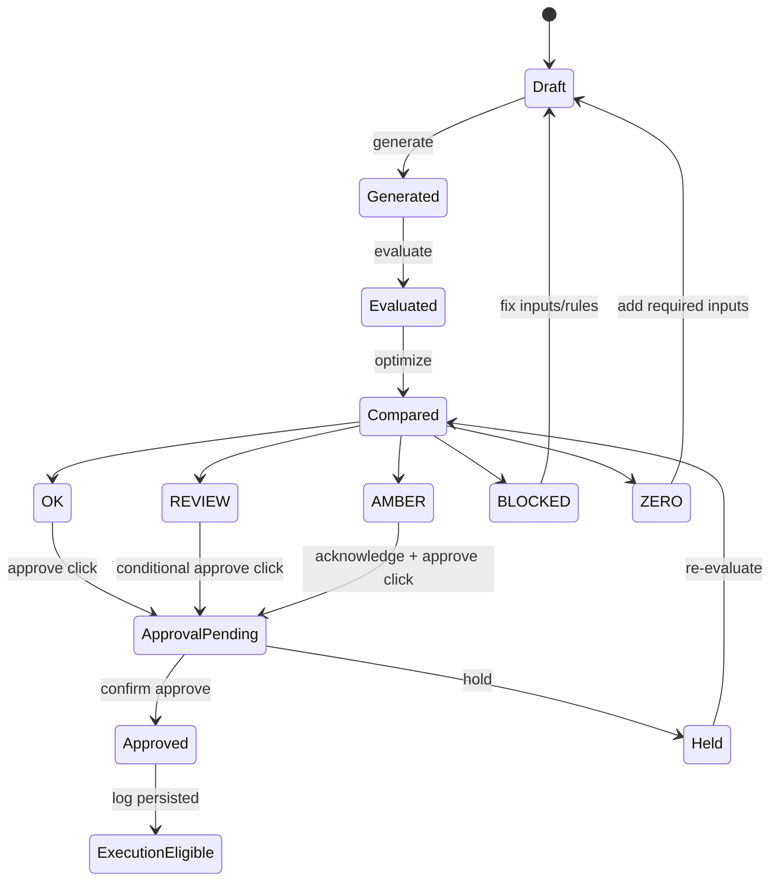
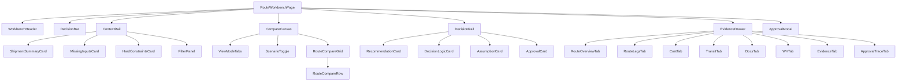

# ROUTE_WORKBENCH_LAYOUT_SPEC_v2026.04

기준일: 2026-04-09  
범위: Multi-Route Optimization + Cost vs Transit Tradeoff Engine  
대상: 운영자 / 승인자용 Desktop-first Workbench  
상태: Final Layout Spec (개발 착수 가능)

---

## 0. 문서 목적

본 문서는 `Route Workbench`의 최종 레이아웃 SSOT이다.  
목표는 아래 5가지를 동시에 만족하는 것이다.

1. `ShipmentRequest` 기준으로 route options를 한 화면에서 비교
2. `recommended_route`, `status`, `decision_logic`, `evidence_ref`를 즉시 검토
3. `Dry-run → Approval → Execution` 분리를 레이아웃 수준에서 강제
4. `BLOCKED / REVIEW / AMBER / ZERO`의 reason/assumption을 숨기지 않음
5. 감사/재현/검증에 필요한 Evidence, Rule Version, Decision Log 접근을 보장

---

## 1. 최종 판정

최종 레이아웃은 **2.5-pane Workbench + Contextual Evidence Drawer**로 확정한다.

- 좌측: Context Rail
- 중앙: Compare Canvas
- 우측: Decision Rail
- 부가: Route-scoped Contextual Drawer
- 보조 모드: Overview / Compare / Audit

이 구조는 “비교”를 중심에 두면서도, 세부·감사·증거를 **progressive disclosure** 방식으로 분리해 고복잡 운영 화면의 cognitive load를 줄이기 위한 설계다.

---

## 2. 비가역 제약(Non-negotiable Constraints)

### 2.1 제품 계약 제약
- 이 제품은 **operations decision engine**이며 booking automation system이 아니다.
- 결과는 `recommended_route` 1건 또는 명시적 blocked state를 반환해야 한다.
- 필수 응답 필드는 `status`, `recommended_route`, `options`, `decision_logic`, `evidence_ref`다.
- 상태값은 `OK`, `REVIEW`, `BLOCKED`, `AMBER`, `ZERO` 고정이다.
- `BLOCKED / REVIEW / AMBER / ZERO`는 explicit reason code 또는 assumption note를 포함해야 한다.
- `Dry-run → Approval → Execution` 분리를 보존해야 하며, approval 이전 downstream execution은 허용하지 않는다.
- 금액은 `AED`, 소수점 2자리. 시간은 `days`, 소수점 2자리.

### 2.2 UI/UX 운영 제약
- 승인형 실행은 기본값이다.
- 승인 UI는 최소 `실행 요약 / 위험 / 승인·취소 / 실행 후 증거` 4요소를 포함한다.
- 근거→결정→실험→결과의 traceability가 남아야 한다.
- 접근성 기준은 WCAG 2.2 AA를 컴포넌트 DoD로 반영한다.

---

## 3. 외부 벤치마크 번역 결과

### 3.1 벤치마크 핵심 해석
- 고압 환경 UI는 **mental model에 맞춘 정보 우선순위화**와 **cognitive load 축소**가 핵심이다.
- AI insight는 **source-level verification** 없이는 신뢰를 얻기 어렵다.
- 접근성은 사후 보정이 아니라 layout 단계에서 고정되어야 한다.

### 3.2 이번 제품에 대한 설계 번역
- 입력/비교/결정을 한 화면에서 유지하되, 세부는 drawer로 지연 노출
- `evidence_ref`, `rule_version`, `reason codes`는 비교 화면과 한 홉 거리 안에 배치
- sticky rail 구조를 쓰더라도 focus가 가려지지 않도록 drawer/rail/modal stacking 규칙 명시
- approval은 rail에 두고, execution은 절대 동일 surface에 두지 않음

---

## 4. 화면 구조 개요



---

## 5. 최종 화면 인벤토리

| 화면/영역 | 목적 | 항상 표시 | on-demand |
|---|---|---|---|
| Header | 식별/전역 액션 | 예 | 아니오 |
| Decision Bar | 현재 판정과 핵심 요약 | 예 | 아니오 |
| Context Rail | 입력 요약/누락/제약/필터 | 예 | 아니오 |
| Compare Canvas | route options 비교 중심 | 예 | 아니오 |
| Decision Rail | 추천/가정/승인 | 예 | 아니오 |
| Contextual Evidence Drawer | 선택 route의 세부/근거 | 아니오 | 예 |
| Approval Modal | 승인/보류 확정 | 아니오 | 예 |
| Audit Mode Surface | 결정 이력/traceability | 아니오 | 예 |

---

## 6. Desktop Layout Spec

### 6.1 기본 그리드
- 기준 viewport: `1440px 이상`
- 상단 고정 영역:
  - Header: `64px`
  - Decision Bar: `56px`
- 본문 영역:
  - Context Rail: `280px`
  - Compare Canvas: `min 720px`, `flex 1`
  - Decision Rail: `360px`
- Drawer:
  - Contextual Evidence Drawer: `520px`
- 기본 간격:
  - page padding: `24px`
  - section gap: `16px`
  - card gap: `12px`

### 6.2 레이아웃 ASCII
```text
┌────────────────────────────────────────────────────────────────────────────┐
│ Header: Route Workbench | Request ID | POL→POD | Priority | Rule Version │
├────────────────────────────────────────────────────────────────────────────┤
│ Decision Bar: Status | Recommended | Feasible | Reasons | Assumptions    │
│               Evidence | Last Evaluated | Incomplete Inputs              │
├───────────────┬──────────────────────────────────────────┬────────────────┤
│ Context Rail  │ Compare Canvas                           │ Decision Rail  │
│ 280px         │ min 720px / fluid                        │ 360px sticky   │
│               │                                          │                │
│ Shipment      │ View Tabs: Overview | Compare | Audit    │ Recommended    │
│ summary       │ Scenario: Recommended / Cheapest /       │ route          │
│ Missing input │ Fastest                                  │ Decision logic │
│ Hard limits   │ --------------------------------------   │ Reason summary │
│ Filters       │ Option row-cards / compare grid          │ Assumptions    │
│ Edit request  │ Select row → open drawer                 │ Approve/Hold   │
│               │                                          │ Safe next step │
├───────────────┴──────────────────────────────────────────┴────────────────┤
│ Contextual Evidence Drawer (right overlay, 520px)                         │
│ Route overview | Legs | Cost | Transit | Docs | WH | Evidence | Trace    │
└────────────────────────────────────────────────────────────────────────────┘
```

---

## 7. 영역별 상세 규격

### 7.1 Header
**목적**: 현재 request의 identity와 전역 액션을 고정  
**필수 요소**
- `Route Workbench`
- `request_id`
- `POL → POD`
- `priority`
- `rule_version`
- action group: `Re-evaluate`, `Open request`, `View logs`

**금지**
- 승인 버튼
- execution 버튼
- 대량 상세 필드 표시

---

### 7.2 Decision Bar
**목적**: 사용자가 진입 즉시 현재 판정과 검토 우선순위를 이해하도록 함

**필수 슬롯**
1. `status`
2. `recommended_route`
3. `feasible_count / total_count`
4. `reason_count`
5. `assumption_count`
6. `evidence_count`
7. `last_evaluated_at`
8. `incomplete_input_count`

**표현 규칙**
- 상태는 color + icon + text 3중 부호화
- `BLOCKED / ZERO`는 bar 안에 short reason 1줄 필수
- `AMBER`는 `가정:` prefix 노출
- `REVIEW`는 `manual review required` badge 노출

---

### 7.3 Context Rail
**목적**: 비교 전에 현재 shipment의 컨텍스트와 누락 입력을 빠르게 확인

**카드 순서**
1. `Shipment Summary`
2. `Missing / Stale Inputs`
3. `Hard Constraints`
4. `Filters`
5. `Edit Request CTA`

**Shipment Summary 최소 필드**
- POL / POD
- cargo type
- cntr type / qty
- dims / wt / COG 요약
- ETD target
- required delivery date
- Incoterm
- destination site / WH

**Missing / Stale Inputs 카드**
- HS missing
- customs unknown
- WH snapshot stale
- docs incomplete
- FX unresolved

**Hard Constraints 카드**
- lane unsupported
- OOG / heavy-lift / hub restriction
- deadline risk
- doc gate
- WH gate

**금지**
- cost breakdown full table
- decision logic full text
- approval trace

---

### 7.4 Compare Canvas
**목적**: 이 제품의 핵심 surface. 모든 route 비교는 여기서 끝나야 한다.

#### 7.4.1 상단 컨트롤
- View tabs: `Overview | Compare | Audit`
- Scenario toggle: `Recommended | Cheapest | Fastest`
- Sort: `rank | cost | transit | risk`
- Filter chips:
  - feasible only
  - docs-ready only
  - wh-safe only
  - low-risk only

#### 7.4.2 표시 단위
기본은 **row-card hybrid**.

각 route row는 아래를 가진다.
- route badge (`SEA_DIRECT` / `SEA_TRANSSHIP` / `SEA_LAND`)
- rank
- feasibility
- ETA
- transit days
- total cost (`AED`)
- risk level
- WH impact
- docs completeness
- reason chip count
- evidence chip count
- `View details`

#### 7.4.3 추천 row 처리
- recommended row는 항상 상단 pin
- recommended row라도 infeasible이면 안 됨
- selected row는 drawer open state와 1:1 연결

#### 7.4.4 Overview / Compare / Audit 모드 차이
- `Overview`: 카드 밀도 낮음, 핵심 6필드만
- `Compare`: full matrix, 정렬/필터 활성
- `Audit`: ranking reason, evidence ref, decision timeline 우선

---

### 7.5 Decision Rail
**목적**: “무엇을 추천했고 왜 그런지, 지금 무엇을 해야 하는지”를 한 영역에 묶음

**블록 순서**
1. `Recommended Route Summary`
2. `Decision Logic`
3. `Reason / Assumption Summary`
4. `Approval Controls`
5. `Safe Next Step`

**Recommended Route Summary**
- route code
- rank
- total cost
- transit days
- ETA
- risk
- feasibility status

**Decision Logic**
- priority
- weight_cost
- weight_time
- weight_risk
- weight_wh
- key penalties
- tie-break result (존재 시)

**Reason / Assumption Summary**
- top 3 reason codes
- active assumptions
- missing inputs summary
- evidence chips

**Approval Controls**
- `Approve`
- `Hold`
- `Request Re-evaluation`
- optional note field

**Safe Next Step**
- `Approved → execution eligible only`
- `Review required`
- `Input required`
- `Blocked — no execution`

**금지**
- booking submit
- customs submit
- carrier action
- payment/contract action

---

### 7.6 Contextual Evidence Drawer
**목적**: 선택된 route에 대한 세부, 증거, 감사 정보를 route-scoped로 제공

**탭 순서**
1. `Overview`
2. `Route Legs`
3. `Cost Breakdown`
4. `Transit & Buffers`
5. `Docs & Customs`
6. `WH Impact`
7. `Evidence & Rule Version`
8. `Approval Trace`

**탭별 최소 데이터**
- Overview: route summary, feasibility, reason codes
- Route Legs: seq, mode, origin, destination, restrictions
- Cost Breakdown: freight, surcharge, DEM/DET exposure, inland, handling, buffer, total
- Transit & Buffers: ETD, ETA, transit_days, transship/customs/inland buffers
- Docs & Customs: required docs, available docs, customs risk, unresolved checks
- WH Impact: site, date bucket, capacity, allocated, remaining, overload risk
- Evidence & Rule Version: evidence_ref, rule_version, rule artifacts
- Approval Trace: approved_by, approved_at, hold note, re-evaluate note

**Open behavior**
- row click 또는 `View details`
- ESC close
- focus trap 필수
- reopen 시 마지막 탭 복원 금지, 기본은 `Overview`

---

### 7.7 Approval Modal
**목적**: 승인/보류 결정을 가볍게 넘기지 않고 confirm surface에서 묶음

**필수 4요소**
1. 실행 요약 또는 승인 대상 요약
2. 위험 / 되돌리기 가능 여부
3. 승인 / 취소
4. 근거 / 로그 확인 링크

**Approve Modal 내용**
- request_id
- recommended_route
- status
- rule_version
- evidence_ref count
- reason / assumption summary
- acknowledgement checkbox (AMBER/REVIEW 시)

**Hold Modal 내용**
- hold reason required
- optional assignee / follow-up note
- re-evaluate trigger link

---

## 8. 상태 매트릭스

| Status | 의미 | Bar 표현 | Rail CTA | Drawer 기본 탭 | 비고 |
|---|---|---|---|---|---|
| OK | 추천 가능 | success + recommended | Approve 활성 | Overview | 일반 승인 흐름 |
| REVIEW | 수동 검토 필요 | review badge + short reason | Approve/Hold 둘 다 가능 | Evidence & Rule Version | 검토 체크 강조 |
| AMBER | 가정 포함, 완전 차단 아님 | warning + `가정:` | Approve/Hold 가능, 확인 checkbox 필수 | Evidence & Rule Version | assumption 노출 필수 |
| BLOCKED | 실행 금지 | danger + blocked reason | Approve 비활성 | Docs/WH/Reasons 우선 | best-effort 추천 금지 |
| ZERO | 고위험 입력 부족 | critical + Input Required | 전부 비활성, Re-evaluate만 | Overview 또는 Reasons | 필요한 입력 명시 필수 |

---

## 9. 주요 상호작용 흐름



---

## 10. 상태 전이 그래프



---

## 11. 데이터-UI 매핑

| UI 블록 | 주 엔터티 | 표시 필드 |
|---|---|---|
| Shipment Summary | ShipmentRequest | POL, POD, cargo, cntr, dims/wt/COG, ETD, Incoterm, required_delivery_date, site |
| Compare Row | RouteOption + CostBreakdown + TransitTime + ConstraintEvaluation | route_code, feasible, risk_level, total_cost_aed, transit_days, ETA, reason_codes |
| Decision Rail | recommended_route + decision_logic + status | recommended_route, weights, penalties, assumptions, status |
| Evidence Drawer | RouteLeg / CostBreakdown / TransitTime / DecisionLog / RuleSetVersion | legs, components, buffers, evidence_ref, rule_version, approved_by, approved_at |
| Audit Mode | DecisionLog + request-level metadata | ranking_jsonb, decision_logic_jsonb, approval trace, re-evaluate history |

---

## 12. React/Next.js 컴포넌트 경계(권장안)

> 가정: 실제 repo path는 미확정이므로 아래는 **권장 boundary**다.



---

## 13. 프론트엔드 상태 모델(권장안)

```ts
type WorkbenchViewMode = 'overview' | 'compare' | 'audit';
type ScenarioMode = 'recommended' | 'cheapest' | 'fastest';
type RouteStatus = 'OK' | 'REVIEW' | 'BLOCKED' | 'AMBER' | 'ZERO';

interface WorkbenchUIState {
  viewMode: WorkbenchViewMode;
  scenarioMode: ScenarioMode;
  selectedRouteId: string | null;
  activeDrawerTab:
    | 'overview'
    | 'legs'
    | 'cost'
    | 'transit'
    | 'docs'
    | 'wh'
    | 'evidence'
    | 'trace';
  isDrawerOpen: boolean;
  isApprovalModalOpen: boolean;
  filters: {
    feasibleOnly: boolean;
    docsReadyOnly: boolean;
    whSafeOnly: boolean;
    lowRiskOnly: boolean;
  };
}
```

---

## 14. 반응형 규칙

### 14.1 Primary
- primary target: `desktop ≥ 1280px`
- secondary target: `tablet 1024–1279px`
- sub-1024는 read/triage 위주로 축소

### 14.2 Breakpoint 동작
#### ≥1440
- full 2.5-pane
- decision rail sticky
- drawer overlay 520px

#### 1280–1439
- context rail 축소 가능
- compare canvas 우선
- decision rail 320px까지 축소 허용

#### 1024–1279
- context rail → top accordion
- decision rail 유지
- compare grid density 1단계 감소

#### <1024
- compare rows는 stacked cards
- drawer는 full-screen sheet
- approval action은 정책 확인 후 허용

---

## 15. 접근성 DoD

### 15.1 필수
- keyboard-only로 route selection 가능
- sticky header/rail/drawer가 focus를 가리지 않음
- status 차이는 color 외 text/icon 포함
- drawer/modal focus trap
- tab order logical
- button target size 최소 규칙 충족
- dragging 없이 같은 목적 달성 가능
- approval/help 경로 일관성 유지
- repeated entry 최소화

### 15.2 테스트 포인트
- route row arrow navigation
- `Enter`로 drawer open
- `Esc`로 drawer/modal close
- screen reader로 status + reason + assumption 낭독
- reduced motion 대응
- high contrast mode에서 상태 식별 가능

---

## 16. 이벤트 계측(권장)

| event_name | 필수 payload |
|---|---|
| workbench_loaded | request_id, status, feasible_count |
| scenario_changed | request_id, from, to |
| view_mode_changed | request_id, from, to |
| route_selected | request_id, route_id, rank |
| evidence_drawer_opened | request_id, route_id, default_tab |
| evidence_tab_changed | request_id, route_id, tab |
| approval_clicked | request_id, route_id, status |
| approval_confirmed | request_id, route_id |
| hold_confirmed | request_id, route_id, hold_reason_present |
| re_evaluate_clicked | request_id, reason_type |
| missing_input_viewed | request_id, input_type |

---

## 17. 개발 우선순위

### Phase 1
- Header
- Decision Bar
- Context Rail compact cards
- Compare Canvas row-card hybrid

### Phase 2
- Decision Rail
- Contextual Evidence Drawer
- Approval Modal

### Phase 3
- Audit mode
- event instrumentation
- keyboard/focus hardening
- responsive refinement

---

## 18. QA/Acceptance Checklist

### 기능
- `status`, `recommended_route`, `options`, `decision_logic`, `evidence_ref`가 UI에서 모두 접근 가능
- `OK/REVIEW/BLOCKED/AMBER/ZERO` 상태별 CTA가 분리됨
- `Dry-run → Approval → Execution` 분리가 UI에서 깨지지 않음
- `BEST / CHEAPEST / FASTEST` 시나리오 비교 가능
- `decision_log` / `approval trace` 접근 가능

### 데이터
- 금액 `AED 2 decimals`
- 시간 `days 2 decimals`
- infeasible route는 best-effort 추천으로 숨겨지지 않음
- reason codes와 assumptions가 동일 surface 안에서 확인 가능

### 접근성
- keyboard path 통과
- focus not obscured 통과
- target size 통과
- screen reader로 status/reason 낭독 가능

### 회귀
- selected route → drawer → approval modal 흐름 E2E 통과
- blocked / amber / zero 상태 시나리오 테스트 통과

---

## 19. Patch Summary (기존안 대비)

| Patch | 변경 |
|---|---|
| P1 | 좌측 입력 패널 → compact Context Rail |
| P2 | 하단 상세 탭 상시 노출 제거 |
| P3 | route-scoped Contextual Evidence Drawer 도입 |
| P4 | Overview / Compare / Audit 3모드 도입 |
| P5 | Decision Rail에 evidence/assumption/approval 집중 |
| P6 | status badge 옆 reason/assumption/evidence count 고정 |
| P7 | execution CTA 제거, approval까지만 허용 |

---

## 20. AMBER Open Items

다음 항목은 layout 상 reserve만 하고 값은 고정하지 않는다.

1. Owner / Approver role
2. AMBER vs REVIEW 세부 운영 차이
3. manual override event schema
4. Auth/AuthZ model
5. WH snapshot freshness threshold
6. FX handling

---

## 21. 최종 결론

개발 착수용 최종 layout은 아래 한 줄로 요약된다.

**상단 Decision Bar + 좌측 Context Rail + 중앙 Compare Canvas + 우측 Decision Rail + 선택 route용 Contextual Evidence Drawer**

이 구조는
- 비교 중심 제품 목표를 유지하고,
- 승인형 운영 통제를 보존하며,
- AI/규정/근거 검증을 분리 노출하고,
- cognitive load를 통제하는 최종안이다.
